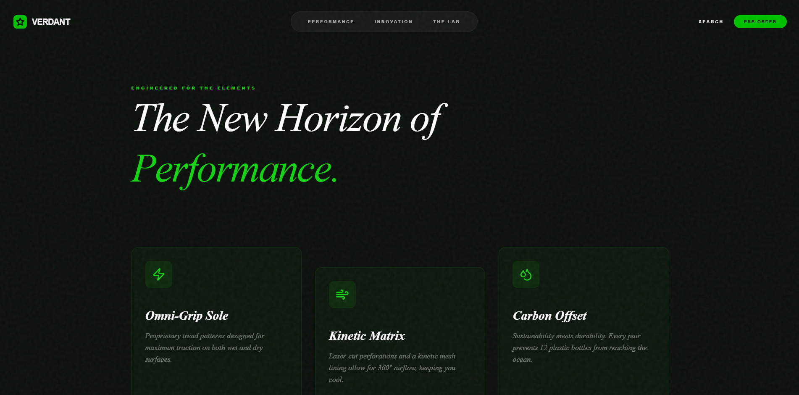

# 🌲👟 Verdant | Eco-Performance Innovation



[](https://github.com/pro-grammer-SD/verdant)

🌟🌈 A flagship product launch experience for **Verdant**, engineered at the intersection of biological fluidity and mechanical precision. This project merges high-end "Quiet Luxury" aesthetics with legacy engineering specifications from the Gaia/Aether/Veloce series.

## 💎 Design Language

- **Visual Identity**: High-contrast "Neon Engineered" palette (#11D411) on deep forest textures.
- **Typography**: Editorial contrast pairing **Playfair Display** (Serif) with **Inter** (Sans).
- **Motion Strategy**: Organic Kinetic principles using Framer Motion springs and GSAP scroll-linked choreography.
- **Glassmorphism**: Hand-crafted glass panels with 12px backdrop blur and micro-neon border highlights.

## 🚀 Technical Architecture

- **Engine**: Vite + React + TypeScript
- **Styling**: Tailwind CSS v4 (Integrated with custom `@theme` tokens)
- **Animation**: Framer Motion (Gestures & Physics) + GSAP (Scroll Storytelling)
- **Icons**: Lucide React + Custom SVG Brand Elements

## 🛠️ Feature Modules

- **Cinematic Hero**: Misty forest staging with parallax typography and floating centerpiece.
- **Feature Discovery**: Asymmetrical glass card grid with interaction-linked staggered entries.
- **3D Viewer Hybrid**: 360° inspection module with reactive hotspots and state-linked morphing.
- **Performance Metrics**: Industrial-grade circular dials with precision animated stat counters.
- **Purchase Engine**: Sticky "Veloce Lab" module with serialized pre-order logic and confirmation states.

## 📂 Project Structure

```text
src/
├── components/
│   ├── primitives/   # Button, Card, Text (Atomic UI)
│   ├── motion/       # Loader, Reveal wrappers
│   └── ...
├── sections/         # Hero, Features, Viewer, Metrics, Purchase
├── lib/              # Core utilities (cn helper)
├── index.css         # Design tokens & legacy specs
└── App.tsx           # Assembly & Global Navigation
```

## 🚥 Getting Started

1. **Clone the repository**:
   ```bash
   git clone https://github.com/pro-grammer-SD/verdant.git
   ```

2. **Install dependencies**:
   ```bash
   npm install
   ```

3. **Run development server**:
   ```bash
   npm run dev
   ```

4. **Production Build**:
   ```bash
   npm run build
   ```

---

*🌿 Designed & Engineered for the Planet.*  
**© 2026 Verdant Engineered Dynamics**
